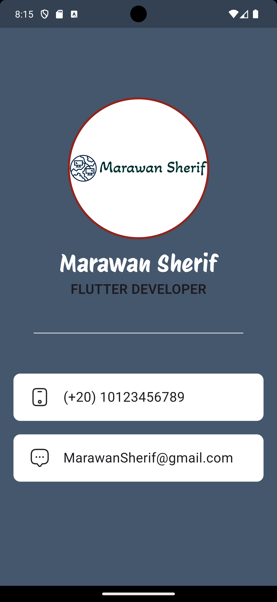

# BusinessCard



**BusinessCard** is a simple Flutter application that displays a personal business card. This project demonstrates how to use Flutter to create a basic mobile application that shows a profile picture, name, job description, phone number, and email address on the screen. The app features a custom background, styled texts, and icons representing the displayed information.

## Features
- Circular profile picture.
- Display of name and job description.
- Display of phone number and email address with representative icons.

## Getting Started

### Prerequisites
- Flutter SDK

### Setup
1. **Clone the repository:**
   ```bash
   git clone https://github.com/yourusername/BusinessCard.git
